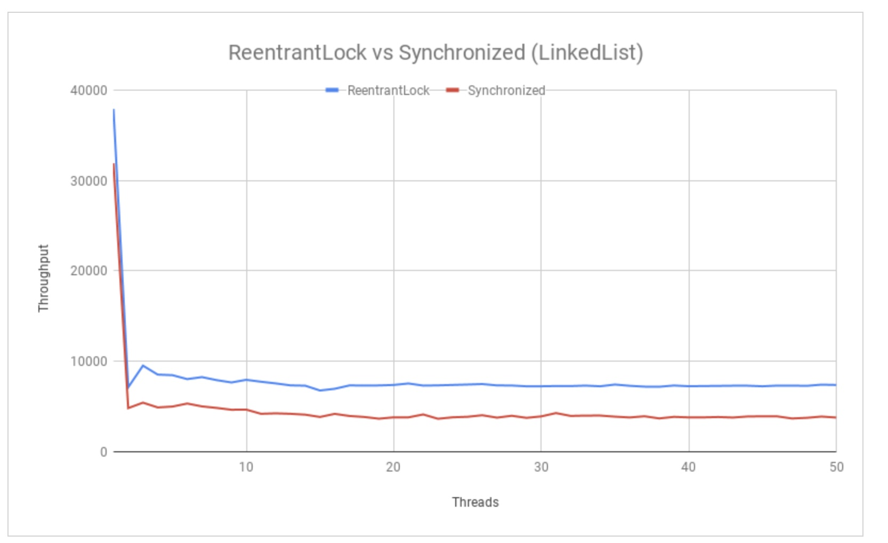

# 大纲

# 前言

悲观锁和乐观锁是面试的高频问题

我们应该有一些概念，

**悲观锁**顾名思义，就是悲观的认为只要不做正确的同步措施，他就一定会出现问题

**乐观锁**是说对于数据的同步我乐观的认为不采用同步措施也不会产生问题，但是如果产生了问题我就进行补救措施，比如retry

多线程间的同步机制主要有**四种**

- 互斥量
- 临界区
- 信号量
- 事件

先不讲这四个的区别，只要先记住，Synchronized就是使用操作系统的互斥量

# 互斥(阻塞)同步—悲观锁

互斥只是同步机制的其中一个手段，也是很常见的保障并发正确性的手段

我们知道传统的锁（如synchronized或者reentrantLock）之所以被称为**重量级锁**，就是因为他使用**操作系统互斥量**来实现同步

## synchronized

这是我们相对来说最熟悉的方式，一般新手学同步的时候，我们都是采用这个关键字，但是这个方式因为是使用**操作系统信号量**，所以相对来说效率比较低

Java中 synchronized能实现同步基础：**Java中的对象都可以作为锁**

### 三种形式：

- 普通同步方法，锁的的对象的实例
- 静态同步方法，锁的是当前类的Class对象
- 对于同步方法块，锁的是括号中的配置对象 

### 实现原理

> JVM 是基于 进入和退出 **monitor对象**来实现方法同步和代码块同步

当synchronized关键字**经过编译**后，会在同步块的前后（同步代码块开始和结束或者异常的地方）分别形成 `monitorenter` 和 `monitorexit`两个字节码指令。

- 每一个monitorenter必定有一个monitorexit与之对应。当执行到monitorenter指令的时候，锁计数器加一，对应的，执行到 monitorexit ，计数器减一。**当计数器为0的时候，锁就被释放**
- synchronized同步块对于同一个线程是可重入的，不会出现自己锁死自己的情况
- 同步块在已进入的线程执行完之前，会阻塞其他线程进入访问

同步方法规范中并没有明说，但是同步方法也可是使用上面两个指令来实现

## ReentrantLock

在基本用法上，ReentrantLock和Synchronized很相似

相比Synchronized，ReentrantLock增加了如下功能：

- 等待可中断
  - 顾名思义，就是等待中的线程可以选择放弃等待，转而做其他事
  - 对于执行时间长的同步块很有帮助
- 可实现公平锁
  - 什么是公平？**先来后到**算一个，谁先申请，谁就先拿，按照申请锁的顺序来排序获取锁的顺序
  - 但是非公平锁，比如Synchronized就不是，他是随机的
  - ReentrantLock 默认也是非公平锁，但是可以通过带布尔值的构造函数来实现公平锁
- 锁可以绑定多个条件
  - 指一个ReentrantLock对象可以同时绑定多个Condition对象，
  - 在Synchronized 中，锁对象的 wait()和notify()或notifyAll()方法可以实现一个隐含的条件，如果要和多余一个条件关联的时候，就不得不额外添加一个锁
  - ReentrantLock 无须这样做，只需要多次调用newCondition()方法就行

## 选择

在最新的版本中，对于Synchronized 的优化非常大，性能已经和ReentrantLock差不太多，所以如果不是使用那些高级功能，还是建议使用 synchronized。毕竟后面还是会大力优化Synchronized

下面是JDK8下，二者性能对比（前者是自增，后者是链表）

# 非阻塞同步—乐观锁

## 版本号