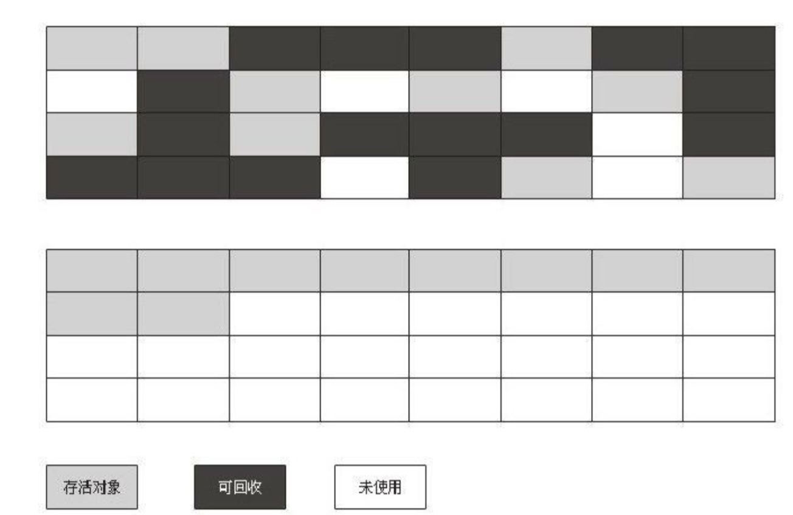

> Java 和 C++ 之间有一堵由内存动态分配和垃圾收集技术所围成的"高强"，墙外面的人想进去，墙里面的人却想出来 	————《深入理解Java虚拟机》

Java 由于JVM自带垃圾回收的机制，所以对于很多初中级的程序猿非常方便，不需要自己写语句控制垃圾的回收，只需要关注业务逻辑即可。尤其是自己写demo或者练手的项目，基本不用担心垃圾回收的事情


但是，对于线上的项目，一旦出现垃圾回收的问题，往往是非常致命的。所以不论是校招还是社招基本都会问到JVM的垃圾回收机制以及算法


这个文章的结构如下

- 哪些内存需要回收
- 什么时候回收
- 如何回收


# 哪些内存需要回收

主要分为两个部分

- 程序计数器，虚拟机栈，本地方法栈
- Java堆和方法区

> 如果你知道 JVM运行时数据区，那么应该知道上面的两部分刚好是按照线程共不共享来划分的。这样也方便记

如果不了解的话，可以参考我的这篇 JVM运行时数据区的文章

## 第一部分

刚刚也提到了，如果了解JVM运行时数据区的话，**第一部分的线程是不共享的**。**他们都随着线程生而生，线程灭而灭**。

这三个区域的内存分配和回收都具备确定性，不必过多考虑回收问题，在方法结束或者线程结束时，内存自然而然就跟着回收了

## 第二部分

基本是运行时才已知，且线程共享，基本上考虑垃圾回收算法以及回收判定都是这两个部分。

### 方法区的回收

在方法区的回收垃圾的性价比一般是比较低的

在JDK1.7或者1.8之前，很多人将方法区和Hotspot中的`永久代`等同。其实二者也是有区别的`前者是 JVM 的规范，而后者则是 JVM 规范的一种实现`

**注意：**只有 Hotspot中才有永久代（PermGen space）的概念，其他的JVM比如Oracle的JRocket和IBM的J9并没有这个概念。 而且永久代从JDK1.7之后就开始逐步移除了，1.8之后就已经完全移除，转为`元空间`

具体可以参考这篇博文，[永久代和元空间](https://www.cnblogs.com/paddix/p/5309550.html)

> 他主要回收的内容是**废弃常量**和**无用的类**

#### 废弃常量

以回收常量池中的字面量为例，如果一个字符串"abcd"已经加入了常量池，但是并没有任何String对象引用常量池中的 "abcd"常量

> 常量池中其他类(接口)、方法、字段的符号引用也与此类似

回收Java堆中的方式也与此类似

#### 无用的类

判定无用的类条件比较严苛，需要同时满足下列三个条件

- 该类所有的实例都已经被回收，也就是Java堆中不存在该类的任何实例
- 加载该类的ClassLoader已经被回收
- 该类对应的`java.lang.Class`对象没有在任何地方被引用，无法在任何地方通过反射访问该类的方法

> 注意这里仅仅是"可以"，而并不是和对象一样，不使用了就必然会回收

# 什么时候回收

当然是对象已经"死掉"的时候，主要有以下两种方法

- 可达性分析(JVM使用)
- 引用计数

## 引用计数法

### 思路

这个逻辑比较简单

- 给对象中添加一个引用计数器，
- 每当有一个地方引用它时，计数器值就加1
- 当引用失效时，计数器值就减1
- 当计数器为0的对象就是不可能再被使用的

### 缺点

但是这个方法有一个缺点：**互相引用的对象不会被回收**

比如有下面代码(除此之外没有其他引用，这两个对象也不会被访问，应该回收)

```java
obj1.instance = obj2;
obj2.instance = obj1;
```

对于使用 这种判定算法的虚拟机，并不会收到回收他们通知，就不会回收他们两个

## 可达性分析法

### 思路

- 通过一系列的称为 "GC Root"的对象作为起始点
- 从这些节点开始向下搜索，搜索走过的链称为`引用链`
- 当一个对象到 GC Root 没有任何引用链相连，则证明此对象是不可用的(用图论的话，就是GC Root到这个对象不可达)

### 可以作为GC Root的对象

- 虚拟机栈中引用的对象
- 本地方法栈中 JNI(即一般说的Native方法)引用的对象
- 本地方法区中
  - 类静态属性引用的对象
  - 常量引用的对象

> 即便是不可达的对象也不是立即进行回收，他会经历两次标记的过程

## 引用

不论是可达性分析算法还是引用计数法，要判定对象是否"死亡"，都需要根据引用来判定

在Java中一共有四种引用(JDK1.2之后)，强度依次递减

- 强引用(一定不会回收)
- 软引用(内存不够回收)
- 弱引用(发生回收就会回收)
- 虚引用()

### 强引用

`Strong Reference`在代码中普遍存在的，只要强引用存在，JVM就一定不会回收。

比如`Object obj = new Object();`

### 软引用

`Soft Reference`发生内存溢出异常之前，将这些软引用连接的对象列近回收范围之中的第二次回收。如果这次回收之后还没有足够的内存，才会抛出内存溢出异常

### 弱引用

`Weak Reference`只能活到下一次垃圾回收发生之前。无论内存是否足够，都会将软引用连接的对象回收

### 虚引用

`Phantom Reference`，他是最弱的一种引用关系。一个对象是否含有虚引用的存在，完全不会对其生存时间构成影响，也无法通过虚引用来取得一个对象实例

**"为一个对象设置虚引用关联的唯一目的就是能在这个对象被回收时收到一个系统通知”**	 ————《深入理解Java虚拟机》

如果想多了解java四种引用的应用说明，可以参考下面这篇博文；

[java四大引用的特点及应用场景](https://www.jianshu.com/p/825cca41d962)

# 如何回收

垃圾收集算法主要有四种：

- 标记-清除
- 标记-复制
- 标记-整理
- 分代收集

## 标记-清除

顾名思义，标记需要清除的对象然后清除。他是最最基础的，之后的都是通过他改进的


### 缺点

- 效率：标记和清除的效率都不高
- 空间：清理后会产生大量的不连续的内存，之后分配大内存对象时，不得不提前触发垃圾回收

## 标记-复制

### 过程

将内存分为两块，每次只使用其中一块。每次垃圾回收时，将存活的对象复制到另一块，然后清理那块全部空间。


### 不足

- 内存少了一半

比较适合可以大量进行垃圾回收的新生代

> 为了解决这个问题，JVM将新生代的 Eden区和其中一个survivor区域划分比例调整为8：1.而survivor共有两个，每次只用其中一个，另一个用来复制，存放活着的对象


## 标记-整理

### 过程

标记过程一样，就是清除的时候，将所有活着的对象移到一端。然后清理剩下的区域



### 缺点

-   回收效率不高。

> 所以一般用在老年代的回收

## 分代收集算法

主流的虚拟机都采用这种算法

主要是根据不同代的特点，选择相对合适的上述算法。

比如Java新生代对象存活率比较低，有大批的对象死去，所以采用`标记-复制`算法，而老年代的对象相对比较稳定，存活率较高而且对象较少，也没有额外的空间对他进行分配担保，所以就采用`标记-整理`算法

# Hotspot中算法实现

- 枚举根节点
- 安全点
- 安全区域

## 枚举根节点

之前也说到了，JVM使用的是可达性分析法。但是可达性分析算法也有他的缺点：

- 耗费时间
- GC停顿

> 耗费时间是因为使用可达性分析算法的时候寻找GC Root的时候。要扫描整个区域，但是仅仅方法区一般都数百兆。
>
> 上文提到可作为GC Root节点的对象有全局性的引用(常量和静态属性)，执行上下文(如栈帧中的本地变量表)。

> GC停顿是指在进行可达性分析的时候，这项工作必须在一个能确保一致性快照中进行。一致性是指在那一段时间内对象关系不能再反复发生变化

那么怎么缩短这个时间呢？

这个要得益于Hotspot虚拟机的**准确式内存管理**。因为有他，所以在Hotspot中，是使用一组称为`OopMap`的数据结构。在类加载完成的时候，Hotspot就把对象内什么偏移量上是什么类型计算出来，在JIT编译过程中，也会在特定的位置记录下栈和寄存器中哪些位置是引用。

这样的话，就不需要进行全盘扫描，只需要扫描OopMap就可以完成GC Root的枚举

## 安全点

### 作用

使用OopMap貌似是解决了时间的问题，但是如果为每一条指令都生成OopMap，那么空间的开销非常大。因为OopMap内容变化的指令非常多。

**所以安全点的作用实际上是解决OopMap空间开销的问题**

### 概念

那么什么地方的节点称为`"安全点"`呢？只在特定的位置记录指令信息，这些位置叫安全点。

为啥叫安全点呢？因为程序执行时并非在所有地方都能停顿下来开始GC，只有到达特定节点——安全点才能暂停。因为他们已经"安全“了，可以放心的进行分析了

### 选取标准

问题又来了，那么以什么标准来选取呢？选取的不能太少，免得GC等待时间长；也不能太多，免得频繁进行。

**所以选取的标准是：是否具有让程序长时间执行的特征**。

最明显的特征就是——**指令复用**

- 方法调用
- 循环跳转
- 异常跳转

### 如何完成

那么怎么让线程跑到安全点然后让他们停下来呢?

有两种实现方式

- 抢先式中断
- 主动式中断(**基本采用这种**)

> 抢先式中断：不需要线程主动配合，发生GC时，所有的线程中断，如果发现有的线程没有跑到安全点，就让他再运行，跑到安全点再中断

> 主动式中断：当GC需要中断线程的时候，不需要操作线程。仅仅设置一个标志位，然后让线程主动去轮询他，发现标志位为真，就中断。轮询标志位和安全点是重合的

## 安全区域

安全点似乎已经解决了枚举根节点时的空间效率问题，但是还存在一个缺陷：**当我的线程没有执行的时候咋办**？比如我的线程这个时候正在`sleep状态`或者`block状态`，那我不可能让他们自己走到相应的安全点。针对这个情况，Hotspot中提出了一个新的解决方法——安全区域

清楚了上面安全点的概念，那么你就可以把安全区域当成是他的拓展，这里一大片的地方都是安全的——引用关系都不会发生变化

当线程执行到`安全区域`中的代码时，就先标示自己已经进入到了安全区域，这样的话，当在这段时间JVM要发起GC的时候，就不用管标示为安全区域的线程了。

 **当线程要离开安全区域时，他要判断是否已经完成了根节点的枚举，如果完成了那就继续执行，没有完成的话那就只能等待直到收到可以离开安全区的信号为止**

# 总结

1. JVM采用可达性分析方法找出需要回收的对象

2. 需要回收的对象主要是

   - 废弃常量
   - 无用的类

3. java中的四种引用

   - 强引用
   - 软引用
   - 弱引用
   - 虚引用

4. Hotspot采用分代回收算法

   - 新生代采用标记-复制
   - 老年代采用标记-整理

5. Hotspot枚举根节点的时候算法实现

   - OopMap
   - 安全点
   - 安全区域

   

