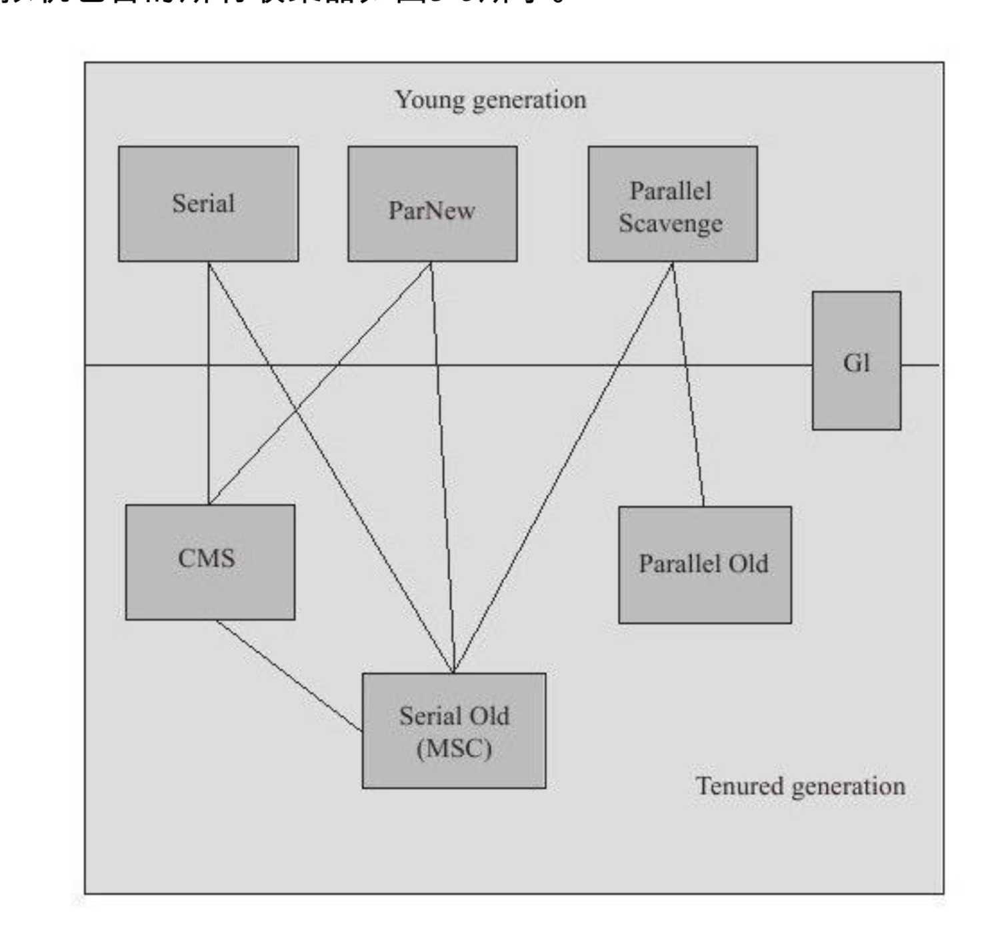
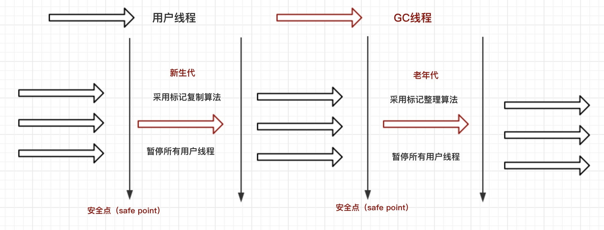
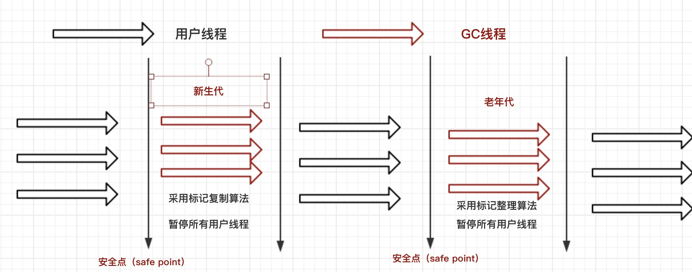

垃圾回收器是垃圾回收的具体实现，这里只讲Hotspot虚拟机的7中不同的垃圾回收器，且是在JDK1.7的情况下，之后会有变革，但是不影响我们了解他们的工作原理

- 新生代
  - Serial
  - ParNew
  - Parallel Scavenge
- 老年代
  - CMS
  - Serial Old
  - Parallel old
- 二者皆可的 G1(JDK1.9之后，成为默认的收集器)

虚拟机使用的时候是采用组合的方式，但是也不是可以随意组合的，组合方式如下

# Serial 收集器

## 特点

- 单线程
- Stop The world
- 在client模式下默认的新生代的收集器

从名字可以看出来他是一个单线程的收集器(Serial有串行的意思)，他在工作的时候，用户的其他所有工作线程都必须停止。这也是"Stop the World"的由来。

但是这种的工作方式让人听难受的，你想想你工作的时候正在兴头上，马上高潮了，突然戛然而止。GC线程出来工作了，你一动不能动。因为它自动发起的，自动完成的，用户不可见，不可预知。

下面用图给你解释下。(**Serial搭配Serial Old**)

如果不了解**标记复制算法**或者**安全点**可以查看我的这篇博文--[垃圾回收算法](https://github.com/leosanqing/Java-Notes/blob/master/JVM/JVM%E5%9E%83%E5%9C%BE%E5%9B%9E%E6%94%B6.md)

# ParNew

## 特点

- 多线程版 Serial收集器

- 很多server模式下首选的新生代收集器

- 其他和Serial一样

  

**多线程版不一定意味着比单线程的Serial的效率高**，因为他有别的线程的频繁交互，随着CPU的增多，才会比他的效率高

## Parallel Scanvenge

## 特点

- 吞吐量优先(最大的特色)

- 自动调节适应

- 多线程

你可以把收集过程和ParNew差不多，图片也差不多。但是他有两个特色

### 吞吐量优先

其他收集器关注的是减少垃圾收集时用户停顿的时间。**而他关注的是达到一个可控的吞吐量**

吞吐量是CPU运行用户代码的时间与CPU消耗的总时间的比值

吞吐量 = 运行用户代码的时间 / (运行用户代码+垃圾回收的时间)。

虚拟机总共运行了 100s，垃圾回收用了 1s，那吞吐量就为99%

由两个参数控制

- -XX: MaxGCPauseMillis
- -XX: GCTimeRatio

根据名字就可以看出来啊，第一个是说回收时的暂停时间、单位毫秒，第二个是回收时间所占的比例。

但是第一个设置的越小，垃圾回收越频繁，总时间不一定会下降。应该很好理解

第二个是GC时间比例,相当于吞吐量的倒数。范围(1,100)的整数。如果设置为1，值为50%=1/(1+1)。**默认为**99，即允许回收时间占1% = 1/(1+99).

### 自动调节适应

参数：-XX：UseAdaptiveSizePolicy

如果打开，那么你就可以不用自己手工去指定新生代的大小、Eden和Survivor区的比例、晋升老年代对象大小(如果一个对象足够大，那么可以直接在老年代分配)。

如果对于收集器的运作不太了解，那么可以打开这个参数，交给虚拟机自己完成

# Serial Old

## 特点

- 和新生代的Serial一样
- 不过server模式下有所不同