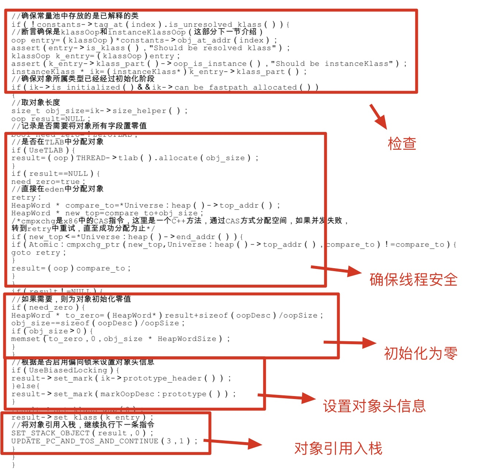

# 对象的创建

在语言层面上，创建对象(例如克隆、反序列化)通常仅仅是一个 new 关键字而已，在虚拟机中，对象（不包括数组和Class对象）又是怎么创建的？

1. 检查
2. 分配内存
3. 设置对象头信息
4. 引用入栈

# 检查

当虚拟机遇到一个`new`指令时，

1. 首先将去检查这个指令的参数是否能再常量池中定位到一个类的符号引用
2. 检查这个符号引用代表的类是否已被加载、解析和初始化
3. 如果没有，必须先执行相应的类加载过程

类加载过程可以参考我的博文 JVM类加载过程

# 分配内存

## 过程

- 划分区域（找到那么大的地方）
- 保证线程安全
- 分配，初始化为零
- 设置对象头信息

要想分配内存，首先得能从内存中找到大于等于要分配内存的空间（主要是在Java堆中，因为实例对象基本存储在Java堆中分配，如果不了解，可以参考我的这篇文章-[Java运行时区域](https://github.com/leosanqing/Java-Notes/blob/master/JVM/Java%E5%86%85%E5%AD%98%E5%8C%BA%E5%9F%9F/Java%E5%86%85%E5%AD%98%E5%8C%BA%E5%9F%9F.md)），然后在这个上面进行内存分配。那么怎么找到这部分内存？

## 划分内存的两种方法

- 指针碰撞
- 空闲列表

**指针碰撞**：假设Java堆中的内存是绝对规整的，所有用过的内存都放在一边，空闲的内存放在另一边，中间放着一个指针作为分界点的指示器，那所分配内存就仅仅是把那个指针向空闲空间那边挪动一段与对象大小相等的距离。

指针碰撞方法的**特点**是：**Java堆要规整**。

> 我们想下哪种收集算法和收集器收集完之后剩下的内存会比较完整呢？没错,标记-整理算法还有采用这种方法的收集器，如Serial，ParNew收集器。
>
> 所以基于他们的收集器的虚拟机就会采用 指针碰撞的方法。

**空闲列表**：如果Java堆不规整，那么就不能简单的采用上面的指针碰撞的方法。人们就想出了用一张表来维护、记录哪些区域可用。分配的时候查表，然后更新

> 所以如果采用标记-清除算法的收集器，CMS就只能采用这种方法

如果不了解**垃圾收集算法**和**垃圾收集器**，可以参考我的这两篇文章，[JVM垃圾收集算法](https://github.com/leosanqing/Java-Notes/blob/master/JVM/JVM%E5%9E%83%E5%9C%BE%E5%9B%9E%E6%94%B6.md)以及JVM垃圾收集器

## 保证线程安全

两种方法：

- CAS配上失败重试
- 使用 TLAB

等下看下书中的代码片段就知道了

## 初始化为零

分配后，需要将分配到的空间初始化为**零值**（不包括对象头，对象内存布局可以参考我的这篇博文---对象的内存布局）。

这样就确保对象的实例字段在Java代码中可以不赋初始值就直接使用。

# 设置对象头信息

虚拟机对对象进行必要的设置，如这个对象是哪个类的实例、如何才能找到类的元数据信息、对象的hash值，这些存储在对象头中。根据虚拟机的状态(如是否启动偏向锁，对象头有不同的设置方式)

# 引用入栈

将对象引用入栈，执行下一条指令

# 代码分析

HotSpot 执行的代码片段

