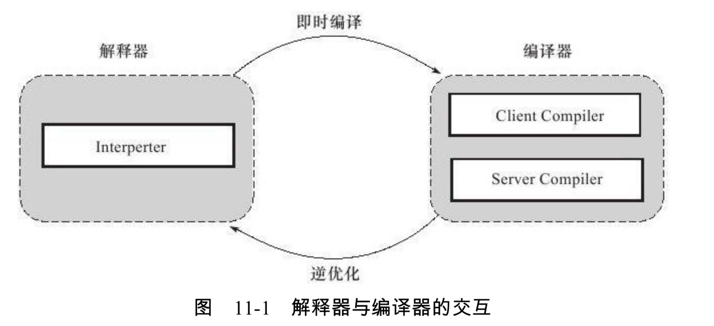
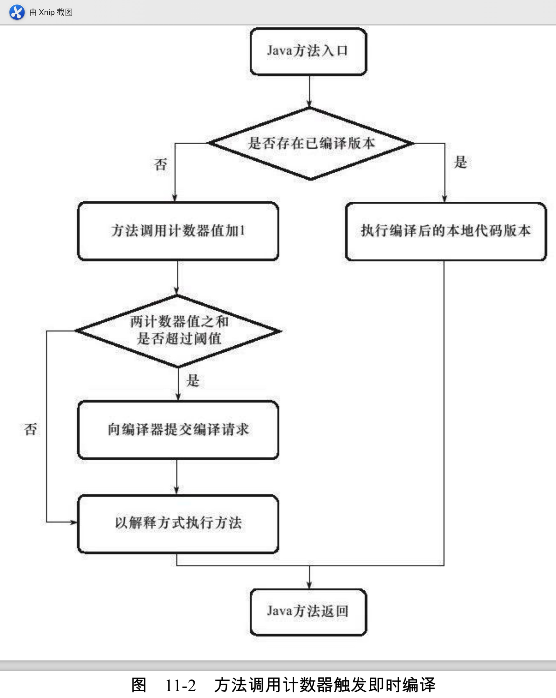
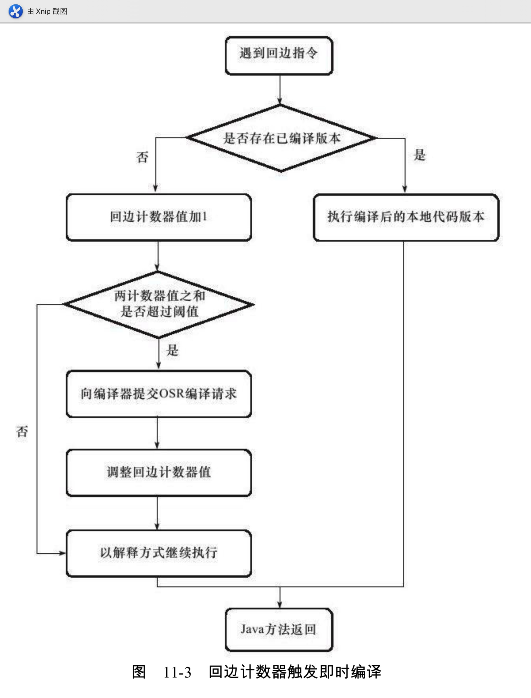

大纲

# 前言

是不是很多人的印象中，Java要比C++运行的慢？如果现在还停留在这个想法，那或许该更新下想法了，因为Java近几年在运行优化方面做了非常多的研究和改进，可以说已经基本不怎么输于C++的运行速度了。

我们参照HotSpot虚拟机的优化来说明，不同虚拟机肯定是不同的，但是也有参考价值。

# 解释器和即时编译器

所谓无风不起浪，**为啥大家觉得Java的执行速度要比C++慢呢？**现在又怎么说二者现在的执行速度差别不太大了呢？

因为早期的Java代码主要都是由**解释器**来完成，并且即使用到**即时编译器**，即时编译器的**性能优化**也做得**不是太好**，所以早期才有了上面说的"Java比C++执行慢"，所以才说那是早期的思想。，现在Java优化做的非常好，我们就挨个说下吧

现在主流的（不是全部）虚拟机都采用**解释器**和**编译器**共存的架构，二者互相配合工作，如下图所示

二者互有优缺点，优缺点正好相对。

- 解释器
  - 优点
    - 程序需要快速启动时，可以省去编译的时间
    - 不占用内存资源，因为不需要编译成本地代码
  - 缺点
    - 执行速度低
  - 还有个作用，作为**"激进优化"**的**逃生门**，本篇后面会讲到
- 编译器
  - 优点
    - 把更多的代码编译成本地代码，提高执行效率
  - 缺点
    - 不能立即启动，编译需要时间
    - 占用一些内存资源

所以啊，虚拟机才会配合二者进行使用。那些"**热点代码**"（这个概念后面会提到）会被即时编译器编译成本地代码，以此来提高执行速度，"非热点代码"就用解释器来执行。为啥这样呢？可能符合"**二八定理**"吧。20%的代码是热点代码，但是他们却可能占用80%的执行资源。

我们看到上面的图片中，**编译器有两种**，一个是客户端的，一个是服务端的，前者被称为C1编译器，后者称为C2编译器，**两个的参数设置也不一样。优化手段也不太一样，后面会讲到**。

# 编译对象与触发条件

## 对象

我们之前提到，即时编译器只编译那些"热点代码"，那么啥是热点代码呢？只有以下两类

- 被多次调用的方法
- 被多次执行的循环体

前者比较好理解，后者有点不好理解。如果一个方法中，**存在循环多次的循环体**，那么这个**循环体的代码**也被执行了很多次，所以也认为是"热点代码"。但是虽然是由于**循环体**造成他是热点代码的，但是**编译器编译**的时候，是根据**整个方法进行编译**(而不是只编译循环体)。这种编译方式由于**编译发生在方法执行过程中**，因此被形象的称为**栈上替换**(On Stack Replacement，简称OSR)。**前者**也是**以整个方法作为编译对象**。

## 条件

那么啥是度呢？多少次才叫多次？才会触发即时编译条件呢？

判断一段代码是不是热点代码，是不是需要触发即时编译，我们称之为**热点探测**，主流的热点探测判定方式有**两种**：

- 基于采样的热点探测
- 基于计数器的热点探测(JVM采用)
- 看到这两个有没有想起以前学过的哪里和这个看上去很像？还记得判定对象是否死亡的两种方法吗？可达性分析和引用计数，其实第一种和可达性分析还真有些地方很像，他可以看调用关系，就像可达性分析的路径。(学知识，这样对照学才会印象深刻，可以说有这样的想法，东西已经算是你的了)

**基于采样的热点探测**：采用这种方法的虚拟机会周期性的检查各个线程的栈顶，如果发现某个(或者某些)方法经常出现在栈顶，那这个方法就是"热点方法"。(有没有像可达性分析法搜索可达路径？)

**基于计数器的热点探测**：为每一个方法(甚至是代码块)建立一个计数器，统计是否超过阈值。还记得两种热点代码吗？他专门准备了两种相对的计数器。前者是方法调用计数器，后者是回边计数器

两个方法优劣对比：

- 基于采样
  - 好处：
    - 实现简单、高效
    - 可以很容易获取方法调用关系(将调用栈展开即可)
  - 缺点
    - 难精确确认一个方法的热度，容易受到线程阻塞或别的因素影响

- 基于计数器
  - 好处
    - 统计精确
  - 缺点
    - 要为每个方法建立一个计数器
    - 不能获取调用关系

# 工作步骤

我们先看图

## 方法调用计数器

当一个方法执行时，

- 首先检查这个方法是否被JIT编译过(即是否存在被JIT编译过的代码版本)
  - 如果有，先执行编译过的代码版本
  - 没有，调用计数+1，判断两个计数器之和是否超过阈值(注意是两个计数器)
    - 超过阈值，向即时编译器提交该方法的编译请求
    - 没有超过，继续以解释器方式执行。
    - 如果不设置，那么他不会等到编译器编译完成，执行编译后的代码，而是执行解释器，下一次调用才执行编译后的代码

这里的方法调用计数器里面的值不是**绝对值**，而是一个相对的**执行频率**，即**一段时间**之内方法被调用的次数。超过一定时间，调用次数仍然未达到阈值，那么方法调用计数器的值就会减少一半，这个过程称为**方法调用计数器热度的衰减**。这个像不像原子的衰变？然后这个时间，他们就取名为**半衰周期**。但是这个是可以关掉的，相关参数设置在**参数那段讲**

## 回边计数器

啥是回边呢？**在字节码中遇到控制流向后跳转的指令**，被称为"**回边**"，这个计数器也是为了触发OSR编译(这个概念，上文讲过)

执行步骤和方法调用计数器相似

不同的是，这个计数器没有所谓的**半衰**

# 相关参数

- `-client/-server`：指定JVM运行哪种模式
- `-Xint`：强制JVM使用解释模式，编译器不工作
- `-Xcomp`：和上面类似，解释器不工作
- `-XX: -UseCounterDecay`:关闭热度衰减
- `-XX: CounterHalfLifeTime`：设置半衰期时长，单位秒
- `-XX: CompileThreshold`:设置方法调用阈值
- `-XX: BackEdgeThreshold`:设置回边计数器阈值
- `-XX： -BackgroundCompilation`：禁止后台编译，达到阈值，等到编译完再往下执行，且执行编译好的代码

# 方法在JVM中的内存布局

一行长度为32bit

# 后台编译过程

后台编译过程，Client Compiler (C1)和Server Compiler(C2)的工作是不一样的，后者更为复杂，是全局优化，前者主要是局部性的优化

## C1

共分为三个阶段：

1. 一个平台独立的前端将字节码构造成一种高级中间代码表示(High-Level Intermediate Representation，HIR)
   - HIR使用静态单分配(SSA)的形式来代表代码值，这可以是的一些在HIR的构造过程之中和之后进行的优化动作更容易实现。
   - 再此之前编译器会在字节码上完成一部分基础优化，如方法内联、常量传播等优化将会在字节码被构造成HIR之前完成
   - 