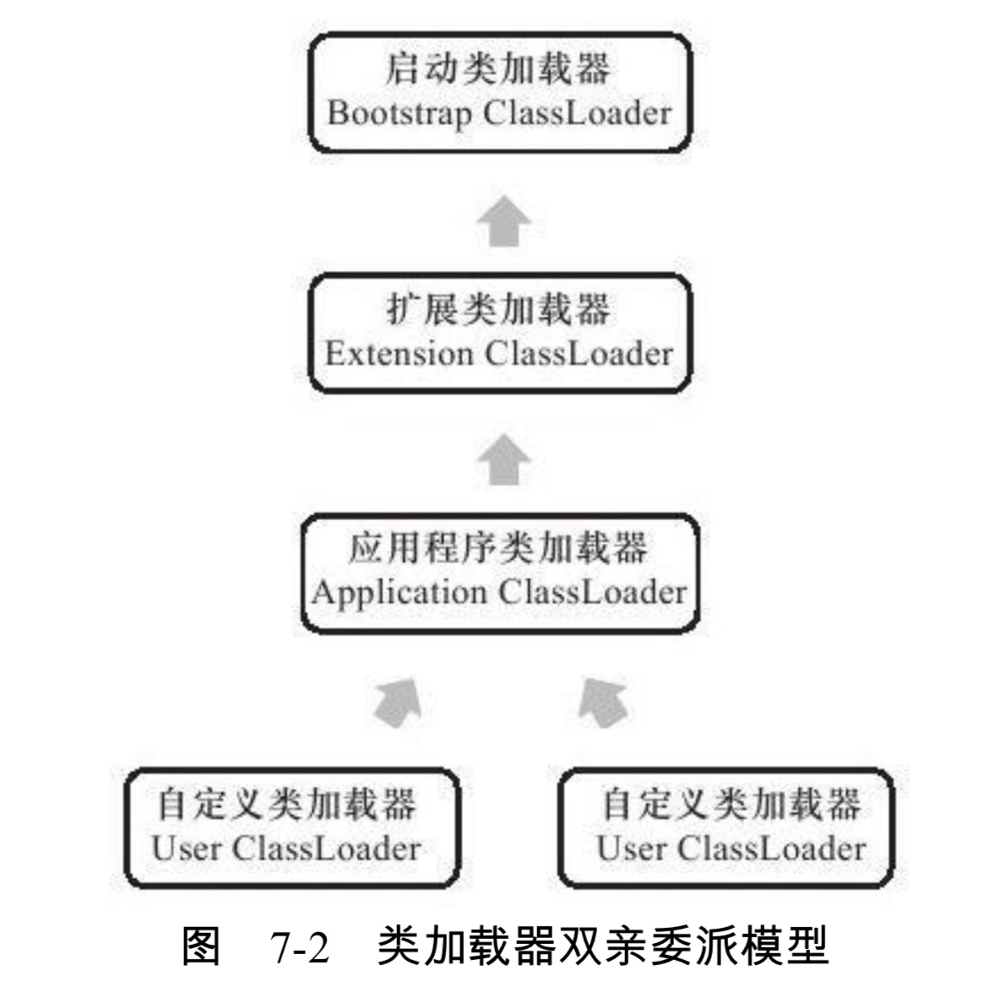

# 大纲


[TOC]

# 前言

类加载器是面试的高频题，类加载器的双亲委派模型更是重中之重，基本问到类加载器就会问到双亲委派模型，那么他到底是什么，又有什么好处呢


# 类加载器

上一节我们知道了类加载的过程，其中加载阶段的第一步"**通过一个类的全限定名来获取描述此类的二进制字节流**"这个动作放到虚拟机外部实现，以便让应用程序自己决定如何去获取所需要的类。这个过程的代码模块就是**类加载器**。


## 类相等条件

- 同一个类文件
- 同一个虚拟机加载
- 同一个类加载器加载
- 其中一个不同，这两个类就不相等


## 类加载器分类

- 启动类加载器(Bootstrap ClassLoader)
  - 将放在`<JAVA_HOME>\lib`目录中的或者被`-Xbootclasspath`参数所指定的路径中的，并且是**虚拟机识别的类库**加载到虚拟机内存(注意三个关键词)
  - 启动类加载器无法被Java程序直接引用
- 扩展类加载器(Extension ClassLoader)
  - 负责加载`<JAVA_HOME>\lib\ext`目录中的，或者被`java.ext.dirs`系统变量所指定的路径中的所有库
  - 开发者可以直接使用这个类加载器
- 应用程序类加载器(Application ClassLoader)
  - 负责加载**用户类路径上**所指定的类库
  - 开发者可以直接使用
  - 如果应用程序中没有定义过自己的类加载器，一般情况下**默认的**类加载器
- 用户自定义类加载器

如果划分的粗一点，那么只用两种

- 启动类加载器
  - 在HotSpot中(其他虚拟机可能不一样)，这个是由C++编写的，是虚拟机的一部分
- 其他类加载器
  - 由Java编写。
  - 独立于虚拟机外部
  - 全部继承自`java.lang.ClassLoader`

# 双亲委派模型

上面我们已经介绍了类加载器，大致可以分为四种：

- 启动类加载器
- 扩展类加载器
- 应用程序类加载器
- 用户自定义的类加载器

他们是相互配合工作的，如果类加载之间的层次是下图这种关系，那么就是**双亲委派模型**



双亲委派模型并**不是强制性的约束模型**，他只是一个Java设计者**推荐的**实现方式

## 工作过程

- 一个类加载器收到了类加载的请求
- 他不会自己尝试加载这个类，而是把这个请求委派给父类加载器去完成
- 每一个类加载器都是如此
- 当父类加载器完不成加载动作，才让子类加载器自己去加载

好比这样的情景：

我们打仗的时候，另外一个陌生的队伍让你调兵支援，这个时候你不能擅作主张，要向上级请示，让上级来进行协调工作，做决定。上级做不了决定，你再尝试随机应变，结合实际情况做决定。

那么你结合情景想想，这样做的好处是啥呢？

## 好处

不会无组织无纪律。

没出问题还好，要是遇到这样的情况，那就真的危险了。假如你不向上级请示，擅作主张，让你增援的那个部队是敌人的，布好阵，就埋伏你，这就要丢性命啊。

或者是上级让你增援另一个部队，因为你离得最近，但是他不知道你不在那个位置，等你接到命令再赶到，友军尸体都凉了

------------------

对应到Java中，就是**保证了运行环境不会混乱**。

**因为Java类随着他的类加载器一起具备了一种带有优先级的层次关系**，

例如所有类的父类(除了它本身)"java.lang.Object",有了双亲委派，无论哪一个类加载器加载，都是交给最顶层的**启动类加载器加载**，这样他在任何类加载器下都是那一个Object类。

如果没有双亲委派，我自己定义一个Object类，放到程序的ClassPath中，那么系统就会出现多个Object，那么**Java体系最基础的行为**就都无法保证了。

## 实现

双亲委派的实现非常简单

- 先检查这个类是否已经被加载过
- 如果没有，调用父类加载器的 loadClass()方法
- 如果父类加载器为空，则调用启动类加载器作为父类加载器
- 如果父类加载失败
  - 抛出异常，但是不进行处理
  - 调用自己的findClass()方法加载

```java
protected Class<?> loadClass(String name, boolean resolve)
    throws ClassNotFoundException
{
    synchronized (getClassLoadingLock(name)) {
        // First, check if the class has already been loaded
        Class<?> c = findLoadedClass(name);
        if (c == null) {
            long t0 = System.nanoTime();
            try {
                if (parent != null) {
                    c = parent.loadClass(name, false);
                } else {
                    c = findBootstrapClassOrNull(name);
                }
            } catch (ClassNotFoundException e) {
                // ClassNotFoundException thrown if class not found
                // from the non-null parent class loader
            }

            if (c == null) {
                // If still not found, then invoke findClass in order
                // to find the class.
                long t1 = System.nanoTime();
                c = findClass(name);

                // this is the defining class loader; record the stats
                sun.misc.PerfCounter.getParentDelegationTime().addTime(t1 - t0);
                sun.misc.PerfCounter.getFindClassTime().addElapsedTimeFrom(t1);
                sun.misc.PerfCounter.getFindClasses().increment();
            }
        }
        if (resolve) {
            resolveClass(c);
        }
        return c;
    }
}
```

# 破坏双亲委派

我们之前说到，双亲委派模型只是一个推荐模型，并不是强制约束，既然是推荐，那我可以不听啊。我就是要破坏，不过这里的**破坏并不是贬义**的，而是对其进行创新。一共大概有三次较大规模的"不听"

- 双亲委派出现后为了保证向前兼容
- 自身设计缺陷
- 用户追求程序动态性

## 第一次

双亲委派模型是JDK1.2之后才有的，但是抽象类`java.lang.ClassLoader`是1.0 就存在了的，面对已经存在的用户自定义类加载器的实现代码，Java设计者不得不做出一些妥协