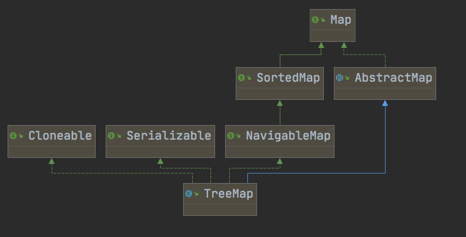

# 前言

不论是 HashMap 还是 ConcurrentHashMap、或者是 TreeMap，在面试和工作中都会用到。尤其是面试，这三样基本都会被问

这篇文章就介绍下TreeMap的源码


# 类继承图



Cloneable 和 Serializable 接口仅仅只是一个标识，可以被克隆和可被序列化


我们主要看右边的那几个类和接口


## Map

Map 是 所有 使用 键值对类型存储的结构的顶级接口，不论是 `HashMap`、`ConcurrentHashMap`、`TreeMap`、`HashTable`等等 都要实现这个接口

它里面定义了N多种 Map这种数据结构需要用到的方法，还有他最最重要的结构 Entry/Node


他的这些基本方法应该不需要我来介绍，看名字应该就能知道他的用途

## SortedMap

这个接口是就是区分和 HashMap等这些没有顺序的Map 很重要的接口

它里面有一个 比较器`Comparator`，这个接口就是用来放置比较规则，让我们放进去的 entry 按照什么规则排列

```java

package java.util;

public interface SortedMap<K,V> extends Map<K,V> {
    
    Comparator<? super K> comparator();

    // 截取Map，输入他的起止 key。因为他是有序的
    SortedMap<K,V> subMap(K fromKey, K toKey);

  	// 截取Map，从头到你输入的Key
    SortedMap<K,V> headMap(K toKey);

   
  	// 截取Map，从你输入的Key到 最后一个元素
    SortedMap<K,V> tailMap(K fromKey);

    // 第一个Key
    K firstKey();

   	// 最后一个Key
    K lastKey();

    // 获取所有Key，并返回 一个Set
    Set<K> keySet();

    // 返回所有Value
    Collection<V> values();

    // 返回键值对
    Set<Map.Entry<K, V>> entrySet();
}
```


## NavigableMap

从他的名字来看，就是 可导航/ 可定位的Map。这个是对上面的 SortedMap的一个补充，他增加了一些方法

```java

public interface NavigableMap<K,V> extends SortedMap<K,V> {
    // 返回比这个 键 更小的 键值对。一定比这个键小
    Map.Entry<K,V> lowerEntry(K key);

   	// 返回比这个 键 更小的 键值对，一定比这个键小
    K lowerKey(K key);
  
  	// 返回 小于或等于 输入键 中的最大的键值对
    Map.Entry<K,V> floorEntry(K key);
  
    K floorKey(K key);

  
  	// 返回 大于或等于 输入键 中的最小的键值对
    Map.Entry<K,V> ceilingEntry(K key);

    // 返回 大于或等于 输入键 中的最小的键
    K ceilingKey(K key);

    // 返回比这个 键 更大的 键值对。一定输入的这个键大
    Map.Entry<K,V> higherEntry(K key);

    K higherKey(K key);

    // 返回第一个键值对
    Map.Entry<K,V> firstEntry();

    // 返回最后一个键值对
    Map.Entry<K,V> lastEntry();

    // 移除并且返回第一个键值对
    Map.Entry<K,V> pollFirstEntry();
  
    Map.Entry<K,V> pollLastEntry();

   	// 返回逆序的键值对
    NavigableMap<K,V> descendingMap();
  	
  	// 返回正序的键值对
    NavigableSet<K> navigableKeySet();

    NavigableSet<K> descendingKeySet();

   	// 返回截取的Map 。开头结尾，各有一个bool值控制是否包含该键值对
    NavigableMap<K,V> subMap(K fromKey, boolean fromInclusive,
                             K toKey,   boolean toInclusive);

    // 返回截取的Map 。从开头到你输入的key，有一个bool值控制是否包含该键值对
    NavigableMap<K,V> headMap(K toKey, boolean inclusive);

    
    NavigableMap<K,V> tailMap(K fromKey, boolean inclusive);

   	// 跟之前类似，不过默认 左闭右开
    SortedMap<K,V> subMap(K fromKey, K toKey);

    // 跟上面类似，不过默认不包括输入的key
    SortedMap<K,V> headMap(K toKey);

    // 跟之前的类似，默认包括输入的key
    SortedMap<K,V> tailMap(K fromKey);
}
```

# 构造函数

```java
public TreeMap() {
    comparator = null;
}


public TreeMap(Comparator<? super K> comparator) {
    this.comparator = comparator;
}


public TreeMap(Map<? extends K, ? extends V> m) {
    comparator = null;
    putAll(m);
}


public TreeMap(SortedMap<K, ? extends V> m) {
    comparator = m.comparator();
    try {
        buildFromSorted(m.size(), m.entrySet().iterator(), null, null);
    } catch (java.io.IOException cannotHappen) {
    } catch (ClassNotFoundException cannotHappen) {
    }
}
```

他一共有 4 个构造方法，不同于我们常见的HashMap，他这个是没有大小一说的，因为他底层不是使用的数组，所以我们也不能一开始给他指定一个大小


如果 我们不指定他的比较器，那么他使用的就是默认的比较器，比如你是自定义的类，没有实现Comparable接口，那么就会报错


如果你传入的是基本类型或者String，那么他就会用他们自己的比较规则去比较

# put

# 红黑树

```java
/**
 *	红黑树最最关键的函数。 左旋右旋都在其中
 *  为了方便，我们先声明一些定义  我们把当前操作的节点称为 关注节点。比如 下面一开始 我们的关注节点就是 x
 */
private void fixAfterInsertion(Entry<K,V> x) {
		// 规定插入必须是红色的
    x.color = RED;
		
  	// 如果是根节点或者他的父节点的颜色是黑色，不用管，因为插入不影响红黑树的样子。否则就要进行下面的逻辑
    while (x != null && x != root && x.parent.color == RED) {
      	// 如果这个节点在祖父节点的左子树
        if (parentOf(x) == leftOf(parentOf(parentOf(x)))) {
          	// 取到他的叔叔节点 y
            Entry<K,V> y = rightOf(parentOf(parentOf(x)));
          	// case1: 如果他的叔叔节点是红色
            if (colorOf(y) == RED) {
              	// 1、设置父亲和叔叔节点为黑色
                setColor(parentOf(x), BLACK);
                setColor(y, BLACK);
              	// 2、设置祖父节点为红色
                setColor(parentOf(parentOf(x)), RED);
              	// 3、把关注节点变成祖父节点
                x = parentOf(parentOf(x));
            } else {
              	// case2: 如果他的叔叔节点是黑色，并且关注节点 x 是其父节点的右子节点
                if (x == rightOf(parentOf(x))) {
                  	// 1. 把关注节点变成他的父节点
                    x = parentOf(x);
                  	// 2.进行左旋
                    rotateLeft(x);
                }
              	// 1.把父节点设置成黑色
                setColor(parentOf(x), BLACK);
              	// 2。祖父节点设置成红色
                setColor(parentOf(parentOf(x)), RED);
                // 3.右旋
              	rotateRight(parentOf(parentOf(x)));
            }
          // 如果是右子树，和上面的情况相反
        } else {
            Entry<K,V> y = leftOf(parentOf(parentOf(x)));
            if (colorOf(y) == RED) {
                setColor(parentOf(x), BLACK);
                setColor(y, BLACK);
                setColor(parentOf(parentOf(x)), RED);
                x = parentOf(parentOf(x));
            } else {
                if (x == leftOf(parentOf(x))) {
                    x = parentOf(x);
                    rotateRight(x);
                }
                setColor(parentOf(x), BLACK);
                setColor(parentOf(parentOf(x)), RED);
                rotateLeft(parentOf(parentOf(x)));
            }
        }
    }
  	// 根节点一定是黑色的 
    root.color = BLACK;
}
```

左旋代码(右旋和左旋类似，逻辑差不多)

```java
private void rotateLeft(Entry<K,V> p) {
    if (p != null) {
      	// 把p之前祖父节点的右子树设置成本节点的左子树
        Entry<K,V> r = p.right;
        p.right = r.left;
        if (r.left != null)
            r.left.parent = p;
        r.parent = p.parent;
      	// 把p的祖父节点换成父节点
        if (p.parent == null)
            root = r;
        else if (p.parent.left == p)
            p.parent.left = r;
        else
            p.parent.right = r;
        r.left = p;
        p.parent = r;
    }
}
```

