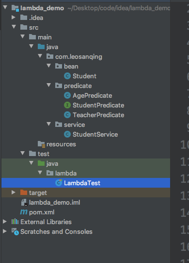

# 前言

>  项目代码在本级目录下的**lambda_demo**中

说起 JDK8 的新特性，总绕不过两个，一个是**流(stream)**，一个就**是 lambda表达式。**

因为 引入 lambda 表达式 可以说是 Java 的**一次革命性的尝试**，因为lambda表达式是**函数式编程**，把函数方法参数化。而之前的 Java 是面向对象的，非常非常严格的。甚至可以说是呆板。

但是 Java的之前的那种风格 或者说设定**并不能说是他的弊端**，对于刚入门编程的人或者初中级的Java编程者来说，Java的这种语法更是他的**优势**，尤其是企业级的应用来说，**易于维护和易于理解比运行效率更重要**。这也是Java最近几年被作为企业级应用程序的首选语言的原因，因为谁都不能保证和你共事的人都是顶尖的人才，你写的他都懂，他写的你都懂


但是，随着软件的发展，会编程的人越来越多，门槛不断升高，你不学习，不进步，那你就只能被退休。连Java都开始改变他的语法了，你都不准备改变吗


这篇文章，我不准备直接讲语法，因为基本每个人第一次看到 lambda语法直接就懵的。讲了也记不住，不理解，不会用，到时候讲了也是白讲

我用个小例子讲述下，我们在做crud的时候，都是怎么完成功能的。然后怎么根据需求变更版本，最后再讲lambda表达式

# 背景


假设我们现在在做一个 **学生管理系统**(类似于这种的管理系统，我想基本应该都做过)。

我们在写**service**部分，根据需求来编写相应的方法


## 项目结构


> Ps: 没有用严格的项目结构，但是大致懂就行啦



## 基本类

```java
package com.leosanqing;

import lombok.AllArgsConstructor;
import lombok.Data;

/**
 * @Author: leosanqing
 * @Date: 2020/1/17 上午7:54
 * @Package: com.leosanqing
 * @Description: 学生类
 */
@Data
@AllArgsConstructor
public class Student {
    private String name;
    private int age;
    private String sex;
    /**
     * 课程
     */
    private String subject;
    private int height;
    private int weight;
    private String teacher;

}

```


## list列表

学生信息分别都是这些

```java
private static List<Student> studentList = new ArrayList<Student>() {
        {
            add(new Student("张三丰", 20, "男", "体育",
                    180, 75, "太上老君"));
            add(new Student("张无忌", 18, "男", "语文",
                    178, 73, "文曲星"));
            add(new Student("赵敏", 17, "女", "数学",
                    170, 50, "太白金星"));
            add(new Student("金毛狮王", 25, "男", "体育",
                    176, 80, "太白金星"));
            add(new Student("周芷若", 16, "女", "语文",
                    168, 48, "太上老君"));
            add(new Student("张三", 21, "男", "英语",
                    172, 65, "如来"));
            add(new Student("赵勇", 26, "男", "体育",
                    188, 80, "太上老君"));


        }
    };
```


## 版本一

**我找出所有学生中的女学生**

这个应该很简单,只需要将写个过滤条件就行

```java
    /**
     * 版本一
     * 找出女学生
     *
     * @return
     */
    public static List<Student> getFemaleStudent(List<Student> studentList) {
        List<Student> students = new ArrayList<>();
        for (Student student : studentList) {
            if ("女".equals(student.getSex())) {
                students.add(student);
            }
        }
        return students;
    }
```


## 版本二

上面的太死了，只能找出女学生。**我要能根据输入的性别来找**。将性别作为参数传进入

```java
    /**
     * 版本二
     * <p>
     * 根据输入性别查找学生
     *
     * @param studentList
     * @param sex
     * @return
     */
    public static List<Student> getStudentBySex(List<Student> studentList, String sex) {
        List<Student> students = new ArrayList<>();
        for (Student student : studentList) {
            if (sex.equals(student.getSex())) {
                students.add(student);
            }
        }
        return students;
    }

```

## 版本三

你这个功能太少了，我要不仅能 **根据输入的年龄或者老师查找**，**也能根据年龄查找的功能**的方法。那我们就多设置几个参数，把那些要求都作为参数传进入

```java

    /**
     * 版本三
     * <p>
     * 根据输入的年龄或者老师查找。true表示使用年龄，false表示使用老师这个参数
     *
     * @param studentList
     * @param age
     * @return
     */
    public static List<Student> getStudentByAgeOrTeacher(List<Student> studentList, int age,
                                                         String teacher, boolean ageOrTeacher) {
        List<Student> students = new ArrayList<>();
        for (Student student : studentList) {
            if ((ageOrTeacher && student.getAge() > age)
                    || !ageOrTeacher && teacher.equals(student.getTeacher())
                ) {

                students.add(student);
            }
        }
        return students;
    }
```

## 版本四

版本三解决了一个需求，但是如果我的需求复杂，要求多呢？我就要输入n多个参数

这个时候，我们就要将其抽象一下，使用面向对象的思想。用一下 策略者模式。(严格意义上说，虽然用Java编程，但是很多人根本连Java都没有入门，因为没有用过 面向对象的思想，基本全是面向过程 。你自己定义过 接口，使用过多态吗？使用过抽象类吗？使用过继承吗？Spring框架很强大，强大到很多人都变"笨"了,我只需要crud，其他的大部分框架已经帮忙做了，我也不需要怎么设计，不用考虑怎么抽出通用的类和方法)


我们定义一个接口

```java
package com.leosanqing.predicate;

import com.leosanqing.bean.Student;

/**
 * @Author: leosanqing
 * @Date: 2020/1/19 下午11:41
 * @Package: com.leosanqing.service
 * @Description: 学生条件接口
 */
public interface StudentPredicate {
    boolean filter(Student student);
}

```

来两个实现类

```java
package com.leosanqing.predicate;

import com.leosanqing.bean.Student;

/**
 * @Author: leosanqing
 * @Date: 2020/1/19 下午11:49
 * @Package: com.leosanqing.predicate
 * @Description: 根据年龄过滤
 */
public class AgePredicate implements StudentPredicate {
    @Override
    public boolean filter(Student student) {
        return student.getAge() > 20;
    }
}

```


```java
package com.leosanqing.predicate;

import com.leosanqing.bean.Student;

/**
 * @Author: leosanqing
 * @Date: 2020/1/19 下午11:51
 * @Package: com.leosanqing.predicate
 * @Description: 根据老师过滤
 */
public class TeacherPredicate implements StudentPredicate{
    @Override
    public boolean filter(Student student) {
        return "如来".equals(student.getTeacher());
    }
}

```


```java
    /**
     * 版本四
     *
     * 使用多态完成，使用策略者模式
     * @param studentList
     * @param predicate
     * @return
     */
    public static List<Student> filterStudent(List<Student> studentList, StudentPredicate predicate) {
        List<Student> students = new ArrayList<>();
        for (Student student : studentList) {
            if(predicate.filter(student)){
                students.add(student);
            }
        }
        return students;
    }
```


## 版本五

我们觉得这个这个太麻烦了，我们只想用的时候再对其进行实现。因此便有了匿名内部类


```java
    /**
     * 版本五，使用匿名内部类。 使用Test测试的时候就是在使用这个方法，我们在使用的时候才去实现具体的方法
     */
    @Test
    public void anonymousInnerClass(){
        final List<Student> studentList = StudentService.getStudentList();
        final List<Student> students = StudentService.filterStudent(studentList, new StudentPredicate() {
            @Override
            public boolean filter(Student student) {
                return "如来".equals(student.getTeacher());
            }
        });
        System.out.println(JSON.toJSONString(students,true));

    }

```

## 版本六

匿名内部类已经够简单的了吧？但是我们还想再简单点，这个时候  lambda就出来了

```java
    /**
     * 版本六，使用lambda
     */
    @Test
    public void lambda(){
        final List<Student> studentList = StudentService.getStudentList();
        final List<Student> students = StudentService.filterStudent(studentList, student -> "如来".equals(student.getTeacher()));
        System.out.println(JSON.toJSONString(students,true));

    }
```

我们看，**lambda表达式其实和匿名内部类结构有点类似**。


通过这样的介绍，现在你应该知道 lambda 表达式 其实也没有那么难理解了吧

